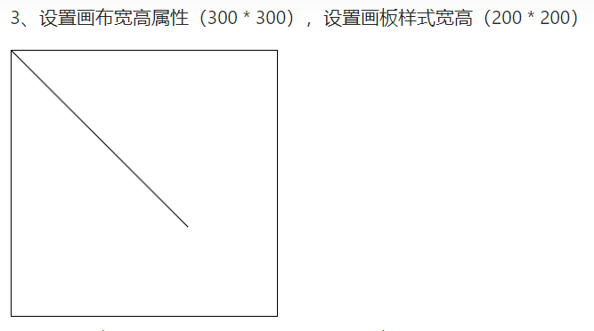

[toc]
# canvas
## .画布与画板
* **区别画板和画布大小**
1. `<canvas width="xx' height='xx'>...</canvas>`此种方法是在定义**画布**(呈现画的图形的区域)的大小，即图形绘制的区域，有可能因为一些不恰当的宽高比产生奇怪的拉伸现象，默认的像素大小是宽度300高度150
2. `<canvas style="width:xx height:xx">...</canvas>`此种方法是在定义**画板**(canvas这个html块)的大小，用来渲染绘制完成的图形的区域，默认为空

|  画布尺寸	| 画板尺寸  |  说明 	| 
| ---	  | ---	| ---	|
| √| x | 画板尺寸随画布尺寸改变  |   
|   x	|  √ 	| 画板尺寸将不再随画布尺寸而改变 |  
|   √	|  √  |  画板尺寸将不再随画布尺寸而改变|   
(总的来说就是，画板一旦设置了大小就不变了，没有设置就跟着画布调整，而画布是有默认大小的)
如果两者设置的尺寸不一样时，就会产生一个问题，渲染时画布要通过缩放来使其与画板尺寸一样，那么画布上已经绘制好的图形也会随之缩放，随之导致变形失真。

* 上面说过，避免图形变形失真，要保持画布尺寸和画板尺寸一致(一致的情况下比例正常不会被奇怪拉伸)。
下面举几个画板画布大小规定不一样造成的（不良）影响：

>这只是针对分辨率不高的设备而言，其 window.devicePixelRatio 为 
1。而高分辨率屏幕，它的 window.devicePixelRatio 大于 1。
   Canvas 绘制的图形是位图，即 **栅格图像 或 点阵图像**，当将它渲染到高清屏时，会被放大，每个像素点会用 window.devicePixelRatio 平方个物理像素点来渲染，因此图片会变得模糊。
* 解决方法：

1. 通过 window.devicePixelRatio 获取当前设备屏幕的 DPR
2. 获取或设置 Canvas 容器的画板尺寸
3. 根据 DPR，设置 Canvas 元素的宽高属性（在 DPR 为 2 时，相当于扩大画布的两倍）
4. 通过 context.scale(dpr, dpr) 缩放 Canvas 画布的坐标系，在 DPR 为 2 时相当于把 Canvas 坐标系也扩大了两倍，这样绘制比例放大了两倍，之后 Canvas 的实际绘制像素就可以按原先的像素值处理

## .非零环绕原则
路径中指定范围区域，从该区域内部画一条足够长的线段，使此线段的完全落在路径范围之外。
该线段与逆时针路径相交，计数器减1；
该线段与顺时针路径相交，计数器加1；
如果计数器的值不等于0，则该范围区域会被填充；
如果计数器的值等于0，则该范围区域不会被填充显示；

|

